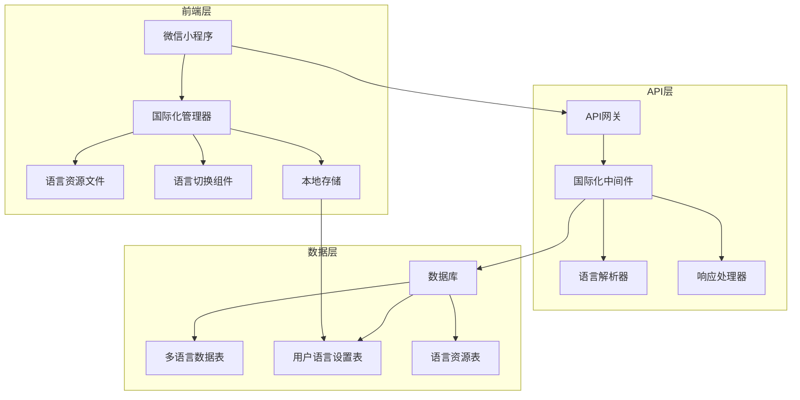

# 微信小程序用户管理系统国际化架构设计

## 1. 国际化架构概述

### 1.1 架构设计原则

1. **分层架构**
   - 前端层：负责界面显示和用户交互的国际化
   - API层：负责请求和响应的国际化处理
   - 数据层：负责多语言数据的存储和管理

2. **模块化设计**
   - 国际化功能独立成模块，便于维护和扩展
   - 语言资源管理模块化，支持动态加载
   - 语言切换功能模块化，便于复用

3. **松耦合设计**
   - 前后端国际化处理相对独立
   - 语言资源与业务逻辑分离
   - 语言切换机制与具体业务分离

### 1.2 架构组件图



## 2. 前端国际化架构

### 2.1 前端国际化组件结构

```
frontend/
├── i18n/                          # 国际化目录
│   ├── locales/                   # 语言资源目录
│   │   ├── en.json                # 英文语言资源
│   │   ├── zh-CN.json             # 简体中文语言资源
│   │   └── zh-TW.json             # 繁体中文语言资源
│   ├── index.js                   # 国际化管理器入口
│   ├── manager.js                 # 国际化管理器
│   ├── utils.js                   # 国际化工具函数
│   └── components/                # 国际化组件
│       ├── language-switcher/      # 语言切换组件
│       │   ├── language-switcher.js
│       │   ├── language-switcher.json
│       │   ├── language-switcher.wxml
│       │   └── language-switcher.wxss
│       └── formatted-text/        # 格式化文本组件
│           ├── formatted-text.js
│           ├── formatted-text.json
│           ├── formatted-text.wxml
│           └── formatted-text.wxss
├── utils/                         # 工具函数目录
│   ├── i18n.js                    # 国际化工具函数
│   └── request.js                 # 网络请求封装（支持国际化）
├── app.js                         # 小程序入口（初始化国际化）
└── app.json                       # 小程序配置
```

### 2.2 国际化管理器设计

```javascript
// i18n/manager.js
class I18nManager {
  constructor() {
    this.currentLocale = 'zh-CN'; // 默认语言
    this.locales = {}; // 语言资源缓存
    this.fallbackLocale = 'zh-CN'; // 回退语言
    this.isInitialized = false;
  }

  // 初始化国际化管理器
  async init() {
    // 从本地存储获取用户语言设置
    const savedLocale = wx.getStorageSync('userLocale');
    
    if (savedLocale && this.isValidLocale(savedLocale)) {
      this.currentLocale = savedLocale;
    } else {
      // 从后端获取用户语言设置
      const userLocale = await this.fetchUserLocaleFromBackend();
      if (userLocale && this.isValidLocale(userLocale)) {
        this.currentLocale = userLocale;
      }
    }
    
    // 加载语言资源
    await this.loadLocales();
    this.isInitialized = true;
  }

  // 验证语言代码是否有效
  isValidLocale(locale) {
    return ['en', 'zh-CN', 'zh-TW'].includes(locale);
  }

  // 从后端获取用户语言设置
  async fetchUserLocaleFromBackend() {
    try {
      const response = await wx.request({
        url: `${API_BASE_URL}/user/locale`,
        method: 'GET',
        header: {
          'Authorization': `Bearer ${wx.getStorageSync('token')}`
        }
      });
      
      if (response.statusCode === 200 && response.data.code === 200) {
        return response.data.data.locale;
      }
    } catch (error) {
      console.error('Failed to fetch user locale from backend:', error);
    }
    
    return null;
  }

  // 加载语言资源
  async loadLocales() {
    const locales = ['en', 'zh-CN', 'zh-TW'];
    
    for (const locale of locales) {
      try {
        const response = await wx.request({
          url: `${API_BASE_URL}/i18n/locales/${locale}`,
          method: 'GET'
        });
        
        if (response.statusCode === 200 && response.data.code === 200) {
          this.locales[locale] = response.data.data;
        } else {
          // 如果从后端加载失败，尝试从本地加载
          this.locales[locale] = await this.loadLocalLocale(locale);
        }
      } catch (error) {
        console.error(`Failed to load locale ${locale}:`, error);
        // 如果从后端加载失败，尝试从本地加载
        this.locales[locale] = await this.loadLocalLocale(locale);
      }
    }
  }

  // 从本地加载语言资源
  async loadLocalLocale(locale) {
    try {
      const fs = wx.getFileSystemManager();
      const content = fs.readFileSync(`/i18n/locales/${locale}.json`, 'utf8');
      return JSON.parse(content);
    } catch (error) {
      console.error(`Failed to load local locale ${locale}:`, error);
      return {};
    }
  }

  // 切换语言
  async setLocale(locale) {
    if (!this.isValidLocale(locale)) {
      console.error(`Invalid locale: ${locale}`);
      return false;
    }
    
    this.currentLocale = locale;
    
    // 保存到本地存储
    wx.setStorageSync('userLocale', locale);
    
    // 保存到后端
    try {
      await wx.request({
        url: `${API_BASE_URL}/user/locale`,
        method: 'PUT',
        data: { locale },
        header: {
          'Authorization': `Bearer ${wx.getStorageSync('token')}`
        }
      });
    } catch (error) {
      console.error('Failed to save user locale to backend:', error);
    }
    
    // 通知所有页面语言已更改
    this.notifyLocaleChange();
    
    return true;
  }

  // 获取当前语言
  getCurrentLocale() {
    return this.currentLocale;
  }

  // 获取翻译文本
  t(key, params = {}) {
    if (!this.isInitialized) {
      console.warn('I18nManager not initialized');
      return key;
    }
    
    const locale = this.locales[this.currentLocale];
    if (!locale) {
      console.warn(`Locale ${this.currentLocale} not loaded`);
      return key;
    }
    
    // 支持嵌套键，如 'user.profile.title'
    const keys = key.split('.');
    let value = locale;
    
    for (const k of keys) {
      if (value && typeof value === 'object' && k in value) {
        value = value[k];
      } else {
        // 如果当前语言没有找到翻译，尝试回退语言
        if (this.currentLocale !== this.fallbackLocale) {
          const fallbackValue = this.getFallbackTranslation(key);
          if (fallbackValue !== key) {
            return this.interpolate(fallbackValue, params);
          }
        }
        return key;
      }
    }
    
    if (typeof value !== 'string') {
      return key;
    }
    
    return this.interpolate(value, params);
  }

  // 获取回退翻译
  getFallbackTranslation(key) {
    const fallbackLocale = this.locales[this.fallbackLocale];
    if (!fallbackLocale) {
      return key;
    }
    
    const keys = key.split('.');
    let value = fallbackLocale;
    
    for (const k of keys) {
      if (value && typeof value === 'object' && k in value) {
        value = value[k];
      } else {
        return key;
      }
    }
    
    return typeof value === 'string' ? value : key;
  }

  // 参数插值
  interpolate(text, params) {
    return text.replace(/\{(\w+)\}/g, (match, key) => {
      return key in params ? params[key] : match;
    });
  }

  // 通知语言变更
  notifyLocaleChange() {
    // 通过全局事件通知所有页面
    const app = getApp();
    if (app && app.globalData) {
      app.globalData.currentLocale = this.currentLocale;
    }
    
    // 触发自定义事件
    wx.event && wx.event.emit('localeChange', this.currentLocale);
  }
}

// 导出单例
export default new I18nManager();
```

### 2.3 语言切换组件设计

```javascript
// i18n/components/language-switcher/language-switcher.js
import i18nManager from '../../manager.js';

Component({
  data: {
    currentLocale: 'zh-CN',
    locales: [
      { code: 'en', name: 'English' },
      { code: 'zh-CN', name: '简体中文' },
      { code: 'zh-TW', name: '繁體中文' }
    ],
    showDropdown: false
  },

  lifetimes: {
    attached() {
      // 监听语言变更事件
      wx.event && wx.event.on('localeChange', this.onLocaleChange, this);
      
      // 获取当前语言
      this.setData({
        currentLocale: i18nManager.getCurrentLocale()
      });
    },
    
    detached() {
      // 移除事件监听
      wx.event && wx.event.off('localeChange', this.onLocaleChange, this);
    }
  },

  methods: {
    onLocaleChange(locale) {
      this.setData({
        currentLocale: locale
      });
    },
    
    toggleDropdown() {
      this.setData({
        showDropdown: !this.data.showDropdown
      });
    },
    
    selectLocale(e) {
      const locale = e.currentTarget.dataset.locale;
      if (locale === this.data.currentLocale) {
        this.setData({
          showDropdown: false
        });
        return;
      }
      
      // 切换语言
      i18nManager.setLocale(locale).then(() => {
        this.setData({
          currentLocale: locale,
          showDropdown: false
        });
        
        wx.showToast({
          title: i18nManager.t('common.languageChanged'),
          icon: 'success'
        });
      });
    },
    
    getCurrentLocaleName() {
      const locale = this.data.locales.find(l => l.code === this.data.currentLocale);
      return locale ? locale.name : '';
    }
  }
});
```

```xml
<!-- i18n/components/language-switcher/language-switcher.wxml -->
<view class="language-switcher">
  <view class="current-language" bindtap="toggleDropdown">
    <text>{{getCurrentLocaleName()}}</text>
    <image class="dropdown-icon" src="/images/dropdown-icon.png"></image>
  </view>
  
  <view class="dropdown" wx:if="{{showDropdown}}">
    <view 
      class="dropdown-item" 
      wx:for="{{locales}}" 
      wx:key="code"
      data-locale="{{item.code}}"
      bindtap="selectLocale"
    >
      <text>{{item.name}}</text>
      <image 
        class="check-icon" 
        src="/images/check-icon.png" 
        wx:if="{{item.code === currentLocale}}"
      ></image>
    </view>
  </view>
</view>
```

## 3. 后端国际化架构

### 3.1 后端国际化组件结构

```
backend/
├── app/
│   ├── api/
│   │   ├── v1/
│   │   │   ├── i18n.py             # 国际化相关API
│   │   │   └── user.py             # 用户相关API（包含语言设置）
│   ├── core/
│   │   ├── config.py               # 配置管理
│   │   ├── security.py             # 安全相关
│   │   └── i18n.py                 # 国际化核心模块
│   ├── models/
│   │   ├── user.py                 # 用户模型
│   │   ├── i18n.py                 # 国际化相关模型
│   │   └── base.py                 # 基础模型
│   ├── schemas/
│   │   ├── user.py                 # 用户数据模型
│   │   └── i18n.py                 # 国际化数据模型
│   ├── crud/
│   │   ├── user.py                 # 用户相关数据库操作
│   │   └── i18n.py                 # 国际化相关数据库操作
│   └── utils/
│       ├── i18n.py                 # 国际化工具函数
│       └── locale.py               # 语言处理工具
└── locales/                        # 语言资源目录
    ├── en/
    │   └── LC_MESSAGES/
    │       ├── messages.po          # 英文翻译文件
    │       └── messages.mo          # 英文翻译编译文件
    ├── zh_CN/
    │   └── LC_MESSAGES/
    │       ├── messages.po          # 简体中文翻译文件
    │       └── messages.mo          # 简体中文翻译编译文件
    └── zh_TW/
        └── LC_MESSAGES/
            ├── messages.po          # 繁体中文翻译文件
            └── messages.mo          # 繁体中文翻译编译文件
```

### 3.2 国际化中间件设计

```python
# app/core/i18n.py
from fastapi import Request, Response
from starlette.middleware.base import BaseHTTPMiddleware
from typing import Optional, Dict, Any
import json
import os

class I18nMiddleware(BaseHTTPMiddleware):
    def __init__(self, app):
        super().__init__(app)
        self.supported_locales = ['en', 'zh-CN', 'zh-TW']
        self.default_locale = 'zh-CN'
        self.locale_cache = {}
        self.load_locales()

    def load_locales(self):
        """加载所有语言资源"""
        for locale in self.supported_locales:
            locale_path = os.path.join('locales', locale.replace('-', '_'), 'LC_MESSAGES', 'messages.json')
            if os.path.exists(locale_path):
                with open(locale_path, 'r', encoding='utf-8') as f:
                    self.locale_cache[locale] = json.load(f)
            else:
                # 如果JSON文件不存在，尝试从PO文件转换
                self.locale_cache[locale] = self.load_from_po(locale)

    def load_from_po(self, locale: str) -> Dict[str, Any]:
        """从PO文件加载翻译"""
        # 这里简化处理，实际项目中可以使用polib等库
        locale_path = os.path.join('locales', locale.replace('-', '_'), 'LC_MESSAGES', 'messages.po')
        translations = {}
        
        if os.path.exists(locale_path):
            with open(locale_path, 'r', encoding='utf-8') as f:
                # 简化的PO文件解析
                current_key = None
                for line in f:
                    line = line.strip()
                    if line.startswith('msgid '):
                        current_key = line[7:-1]  # 去掉msgid "和"
                    elif line.startswith('msgstr ') and current_key:
                        translations[current_key] = line[8:-1]  # 去掉msgstr "和"
                        current_key = None
        
        return translations

    async def dispatch(self, request: Request, call_next):
        # 获取用户语言偏好
        locale = self.get_user_locale(request)
        
        # 将语言信息添加到请求状态中
        request.state.locale = locale
        
        # 处理请求
        response = await call_next(request)
        
        # 处理响应
        response = self.process_response(response, locale)
        
        return response

    def get_user_locale(self, request: Request) -> str:
        """获取用户语言偏好"""
        # 1. 从查询参数获取
        locale = request.query_params.get('lang')
        if locale and locale in self.supported_locales:
            return locale
        
        # 2. 从请求头获取
        accept_language = request.headers.get('Accept-Language', '')
        if accept_language:
            # 解析Accept-Language头
            locales = []
            for item in accept_language.split(','):
                parts = item.strip().split(';')
                lang = parts[0].strip()
                q = 1.0
                if len(parts) > 1 and parts[1].strip().startswith('q='):
                    try:
                        q = float(parts[1].strip()[2:])
                    except ValueError:
                        q = 1.0
                locales.append((lang, q))
            
            # 按优先级排序
            locales.sort(key=lambda x: x[1], reverse=True)
            
            # 查找支持的语言
            for lang, _ in locales:
                # 精确匹配
                if lang in self.supported_locales:
                    return lang
                # 语言匹配（如en-US匹配en）
                lang_code = lang.split('-')[0]
                for supported in self.supported_locales:
                    if supported.startswith(lang_code):
                        return supported
        
        # 3. 从用户设置获取（需要用户登录）
        # 这里需要根据实际的用户认证逻辑获取
        # user_id = get_current_user_id(request)
        # if user_id:
        #     user_locale = get_user_locale_from_db(user_id)
        #     if user_locale and user_locale in self.supported_locales:
        #         return user_locale
        
        # 4. 使用默认语言
        return self.default_locale

    def process_response(self, response: Response, locale: str) -> Response:
        """处理响应，添加语言信息"""
        # 添加语言头
        response.headers['Content-Language'] = locale
        
        # 如果是JSON响应，尝试国际化处理
        if response.headers.get('content-type', '').startswith('application/json'):
            try:
                # 这里简化处理，实际项目中需要根据响应内容进行国际化
                pass
            except Exception:
                pass
        
        return response

    def translate(self, key: str, locale: Optional[str] = None) -> str:
        """翻译文本"""
        if locale is None:
            locale = self.default_locale
        
        if locale not in self.locale_cache:
            locale = self.default_locale
        
        translations = self.locale_cache.get(locale, {})
        return translations.get(key, key)

    def ngettext(self, singular: str, plural: str, count: int, locale: Optional[str] = None) -> str:
        """复数形式翻译"""
        if locale is None:
            locale = self.default_locale
        
        if locale not in self.locale_cache:
            locale = self.default_locale
        
        translations = self.locale_cache.get(locale, {})
        key = f"{singular}|{plural}"
        
        if key in translations:
            # 简化处理，实际项目中需要根据语言的复数规则
            return translations[key]
        
        return singular if count == 1 else plural
```

### 3.3 国际化工具函数

```python
# app/utils/i18n.py
from typing import Dict, Any, Optional, List
import json
import os
from app.core.i18n import I18nMiddleware

class I18nUtils:
    def __init__(self, middleware: I18nMiddleware):
        self.middleware = middleware
    
    def get_supported_locales(self) -> List[Dict[str, str]]:
        """获取支持的语言列表"""
        return [
            {'code': 'en', 'name': 'English', 'native_name': 'English'},
            {'code': 'zh-CN', 'name': 'Simplified Chinese', 'native_name': '简体中文'},
            {'code': 'zh-TW', 'name': 'Traditional Chinese', 'native_name': '繁體中文'}
        ]
    
    def is_locale_supported(self, locale: str) -> bool:
        """检查语言是否支持"""
        return locale in self.middleware.supported_locales
    
    def get_locale_display_name(self, locale: str, display_locale: Optional[str] = None) -> str:
        """获取语言的显示名称"""
        if display_locale is None:
            display_locale = self.middleware.default_locale
        
        locales = self.get_supported_locales()
        for loc in locales:
            if loc['code'] == locale:
                if display_locale == 'zh-CN':
                    return loc['name']
                elif display_locale == 'zh-TW':
                    # 繁体中文显示名称
                    names = {
                        'en': '英文',
                        'zh-CN': '简体中文',
                        'zh-TW': '繁體中文'
                    }
                    return names.get(locale, locale)
                else:
                    return loc['native_name']
        
        return locale
    
    def format_datetime(self, dt, format_str: Optional[str] = None, locale: Optional[str] = None) -> str:
        """格式化日期时间"""
        if locale is None:
            locale = self.middleware.default_locale
        
        if format_str is None:
            # 根据语言设置默认格式
            if locale == 'en':
                format_str = '%Y-%m-%d %H:%M:%S'
            elif locale == 'zh-CN':
                format_str = '%Y年%m月%d日 %H:%M:%S'
            elif locale == 'zh-TW':
                format_str = '%Y年%m月%d日 %H:%M:%S'
            else:
                format_str = '%Y-%m-%d %H:%M:%S'
        
        return dt.strftime(format_str)
    
    def format_number(self, number: float, locale: Optional[str] = None) -> str:
        """格式化数字"""
        if locale is None:
            locale = self.middleware.default_locale
        
        # 简化处理，实际项目中可以使用locale模块
        if locale in ['zh-CN', 'zh-TW']:
            # 中文数字格式
            return f"{number:,}".replace(',', '，')
        else:
            # 英文数字格式
            return f"{number:,}"
    
    def translate_list(self, items: List[str], locale: Optional[str] = None) -> str:
        """翻译列表，返回逗号分隔的字符串"""
        if locale is None:
            locale = self.middleware.default_locale
        
        translated_items = [self.middleware.translate(item, locale) for item in items]
        
        if locale in ['zh-CN', 'zh-TW']:
            # 中文使用顿号分隔
            return '、'.join(translated_items)
        else:
            # 英文使用逗号加空格分隔
            return ', '.join(translated_items)
```

## 4. 数据模型设计

### 4.1 用户语言设置模型

```python
# app/models/i18n.py
from sqlalchemy import Column, Integer, String, DateTime, ForeignKey, Boolean
from sqlalchemy.orm import relationship
from app.models.base import Base
from datetime import datetime

class UserLocale(Base):
    """用户语言设置"""
    __tablename__ = 'user_locales'
    
    id = Column(Integer, primary_key=True, index=True)
    user_id = Column(Integer, ForeignKey('users.id'), nullable=False, unique=True)
    locale = Column(String(10), nullable=False, default='zh-CN')
    is_default = Column(Boolean, default=False)  # 是否为默认语言
    created_at = Column(DateTime, default=datetime.utcnow)
    updated_at = Column(DateTime, default=datetime.utcnow, onupdate=datetime.utcnow)
    
    # 关系
    user = relationship("User", back_populates="locale_setting")

class Translation(Base):
    """翻译表"""
    __tablename__ = 'translations'
    
    id = Column(Integer, primary_key=True, index=True)
    key = Column(String(255), nullable=False, index=True)
    locale = Column(String(10), nullable=False, index=True)
    value = Column(Text, nullable=False)
    context = Column(String(255), nullable=True)  # 上下文信息
    created_at = Column(DateTime, default=datetime.utcnow)
    updated_at = Column(DateTime, default=datetime.utcnow, onupdate=datetime.utcnow)
    
    __table_args__ = (
        # 确保同一语言下key唯一
        UniqueConstraint('key', 'locale', name='uq_translation_key_locale'),
    )

class LocalizedContent(Base):
    """多语言内容表"""
    __tablename__ = 'localized_contents'
    
    id = Column(Integer, primary_key=True, index=True)
    content_type = Column(String(50), nullable=False)  # 内容类型，如role, permission等
    content_id = Column(Integer, nullable=False)  # 内容ID
    locale = Column(String(10), nullable=False)
    field_name = Column(String(50), nullable=False)  # 字段名，如name, description等
    field_value = Column(Text, nullable=False)  # 字段值
    created_at = Column(DateTime, default=datetime.utcnow)
    updated_at = Column(DateTime, default=datetime.utcnow, onupdate=datetime.utcnow)
    
    __table_args__ = (
        # 确保同一内容、同一语言、同一字段的唯一性
        UniqueConstraint('content_type', 'content_id', 'locale', 'field_name', 
                        name='uq_localized_content'),
    )
```

### 4.2 用户模型扩展

```python
# app/models/user.py
from sqlalchemy import Column, Integer, String, DateTime, Boolean, Text
from sqlalchemy.orm import relationship
from app.models.base import Base
from app.models.i18n import UserLocale
from datetime import datetime

class User(Base):
    __tablename__ = 'users'
    
    id = Column(Integer, primary_key=True, index=True)
    username = Column(String(50), nullable=False, unique=True)
    email = Column(String(100), nullable=False, unique=True)
    password_hash = Column(String(255), nullable=False)
    nickname = Column(String(50))
    phone = Column(String(20))
    avatar = Column(String(255))
    bio = Column(Text)
    status = Column(Integer, default=1)  # 1-正常，0-禁用
    created_at = Column(DateTime, default=datetime.utcnow)
    updated_at = Column(DateTime, default=datetime.utcnow, onupdate=datetime.utcnow)
    
    # 关系
    locale_setting = relationship("UserLocale", uselist=False, back_populates="user")
    roles = relationship("UserRole", back_populates="user")
    sessions = relationship("UserSession", back_populates="user")
    
    def get_locale(self) -> str:
        """获取用户语言设置"""
        if self.locale_setting:
            return self.locale_setting.locale
        return 'zh-CN'  # 默认语言
```

### 4.3 角色和权限模型扩展

```python
# app/models/role.py
from sqlalchemy import Column, Integer, String, DateTime, Text
from sqlalchemy.orm import relationship
from app.models.base import Base
from app.models.i18n import LocalizedContent
from datetime import datetime

class Role(Base):
    __tablename__ = 'roles'
    
    id = Column(Integer, primary_key=True, index=True)
    name = Column(String(50), nullable=False, unique=True)  # 内部名称，不显示给用户
    description = Column(String(255))
    created_at = Column(DateTime, default=datetime.utcnow)
    updated_at = Column(DateTime, default=datetime.utcnow, onupdate=datetime.utcnow)
    
    # 关系
    permissions = relationship("RolePermission", back_populates="role")
    users = relationship("UserRole", back_populates="role")
    
    def get_localized_name(self, locale: str = 'zh-CN') -> str:
        """获取本地化名称"""
        localized = LocalizedContent.query.filter_by(
            content_type='role',
            content_id=self.id,
            locale=locale,
            field_name='name'
        ).first()
        
        return localized.field_value if localized else self.name
    
    def get_localized_description(self, locale: str = 'zh-CN') -> str:
        """获取本地化描述"""
        localized = LocalizedContent.query.filter_by(
            content_type='role',
            content_id=self.id,
            locale=locale,
            field_name='description'
        ).first()
        
        return localized.field_value if localized else self.description

class Permission(Base):
    __tablename__ = 'permissions'
    
    id = Column(Integer, primary_key=True, index=True)
    code = Column(String(50), nullable=False, unique=True)  # 权限代码
    name = Column(String(100), nullable=False)  # 内部名称，不显示给用户
    description = Column(String(255))
    category = Column(String(50))
    created_at = Column(DateTime, default=datetime.utcnow)
    updated_at = Column(DateTime, default=datetime.utcnow, onupdate=datetime.utcnow)
    
    # 关系
    roles = relationship("RolePermission", back_populates="permission")
    
    def get_localized_name(self, locale: str = 'zh-CN') -> str:
        """获取本地化名称"""
        localized = LocalizedContent.query.filter_by(
            content_type='permission',
            content_id=self.id,
            locale=locale,
            field_name='name'
        ).first()
        
        return localized.field_value if localized else self.name
    
    def get_localized_description(self, locale: str = 'zh-CN') -> str:
        """获取本地化描述"""
        localized = LocalizedContent.query.filter_by(
            content_type='permission',
            content_id=self.id,
            locale=locale,
            field_name='description'
        ).first()
        
        return localized.field_value if localized else self.description
```

## 5. 数据库设计

### 5.1 用户语言设置表

```sql
-- 用户语言设置表
CREATE TABLE user_locales (
    id BIGSERIAL PRIMARY KEY,
    user_id BIGINT NOT NULL UNIQUE,
    locale VARCHAR(10) NOT NULL DEFAULT 'zh-CN',
    is_default BOOLEAN DEFAULT FALSE,
    created_at TIMESTAMP WITH TIME ZONE DEFAULT CURRENT_TIMESTAMP,
    updated_at TIMESTAMP WITH TIME ZONE DEFAULT CURRENT_TIMESTAMP,
    
    FOREIGN KEY (user_id) REFERENCES users(id) ON DELETE CASCADE
);

COMMENT ON TABLE user_locales IS '用户语言设置表';
COMMENT ON COLUMN user_locales.id IS '设置ID';
COMMENT ON COLUMN user_locales.user_id IS '用户ID';
COMMENT ON COLUMN user_locales.locale IS '语言设置';
COMMENT ON COLUMN user_locales.is_default IS '是否为默认语言';
COMMENT ON COLUMN user_locales.created_at IS '创建时间';
COMMENT ON COLUMN user_locales.updated_at IS '更新时间';

-- 创建索引
CREATE INDEX idx_user_locales_user_id ON user_locales(user_id);
CREATE INDEX idx_user_locales_locale ON user_locales(locale);

-- 创建更新时间触发器
CREATE TRIGGER update_user_locales_updated_at BEFORE UPDATE ON user_locales FOR EACH ROW EXECUTE PROCEDURE update_updated_at_column();
```

### 5.2 翻译表

```sql
-- 翻译表
CREATE TABLE translations (
    id BIGSERIAL PRIMARY KEY,
    key VARCHAR(255) NOT NULL,
    locale VARCHAR(10) NOT NULL,
    value TEXT NOT NULL,
    context VARCHAR(255),
    created_at TIMESTAMP WITH TIME ZONE DEFAULT CURRENT_TIMESTAMP,
    updated_at TIMESTAMP WITH TIME ZONE DEFAULT CURRENT_TIMESTAMP,
    
    UNIQUE(key, locale)
);

COMMENT ON TABLE translations IS '翻译表';
COMMENT ON COLUMN translations.id IS '翻译ID';
COMMENT ON COLUMN translations.key IS '翻译键';
COMMENT ON COLUMN translations.locale IS '语言';
COMMENT ON COLUMN translations.value IS '翻译值';
COMMENT ON COLUMN translations.context IS '上下文信息';
COMMENT ON COLUMN translations.created_at IS '创建时间';
COMMENT ON COLUMN translations.updated_at IS '更新时间';

-- 创建索引
CREATE INDEX idx_translations_key ON translations(key);
CREATE INDEX idx_translations_locale ON translations(locale);
CREATE INDEX idx_translations_key_locale ON translations(key, locale);

-- 创建更新时间触发器
CREATE TRIGGER update_translations_updated_at BEFORE UPDATE ON translations FOR EACH ROW EXECUTE PROCEDURE update_updated_at_column();
```

### 5.3 多语言内容表

```sql
-- 多语言内容表
CREATE TABLE localized_contents (
    id BIGSERIAL PRIMARY KEY,
    content_type VARCHAR(50) NOT NULL,
    content_id BIGINT NOT NULL,
    locale VARCHAR(10) NOT NULL,
    field_name VARCHAR(50) NOT NULL,
    field_value TEXT NOT NULL,
    created_at TIMESTAMP WITH TIME ZONE DEFAULT CURRENT_TIMESTAMP,
    updated_at TIMESTAMP WITH TIME ZONE DEFAULT CURRENT_TIMESTAMP,
    
    UNIQUE(content_type, content_id, locale, field_name)
);

COMMENT ON TABLE localized_contents IS '多语言内容表';
COMMENT ON COLUMN localized_contents.id IS '内容ID';
COMMENT ON COLUMN localized_contents.content_type IS '内容类型';
COMMENT ON COLUMN localized_contents.content_id IS '内容ID';
COMMENT ON COLUMN localized_contents.locale IS '语言';
COMMENT ON COLUMN localized_contents.field_name IS '字段名';
COMMENT ON COLUMN localized_contents.field_value IS '字段值';
COMMENT ON COLUMN localized_contents.created_at IS '创建时间';
COMMENT ON COLUMN localized_contents.updated_at IS '更新时间';

-- 创建索引
CREATE INDEX idx_localized_contents_type_id ON localized_contents(content_type, content_id);
CREATE INDEX idx_localized_contents_locale ON localized_contents(locale);
CREATE INDEX idx_localized_contents_field ON localized_contents(field_name);

-- 创建更新时间触发器
CREATE TRIGGER update_localized_contents_updated_at BEFORE UPDATE ON localized_contents FOR EACH ROW EXECUTE PROCEDURE update_updated_at_column();
```

### 5.4 初始数据

```sql
-- 初始翻译数据
INSERT INTO translations (key, locale, value, context) VALUES
-- 通用翻译
('common.ok', 'en', 'OK', '通用按钮'),
('common.ok', 'zh-CN', '确定', '通用按钮'),
('common.ok', 'zh-TW', '確定', '通用按钮'),

('common.cancel', 'en', 'Cancel', '通用按钮'),
('common.cancel', 'zh-CN', '取消', '通用按钮'),
('common.cancel', 'zh-TW', '取消', '通用按钮'),

('common.save', 'en', 'Save', '通用按钮'),
('common.save', 'zh-CN', '保存', '通用按钮'),
('common.save', 'zh-TW', '保存', '通用按钮'),

('common.delete', 'en', 'Delete', '通用按钮'),
('common.delete', 'zh-CN', '删除', '通用按钮'),
('common.delete', 'zh-TW', '刪除', '通用按钮'),

('common.edit', 'en', 'Edit', '通用按钮'),
('common.edit', 'zh-CN', '编辑', '通用按钮'),
('common.edit', 'zh-TW', '編輯', '通用按钮'),

('common.loading', 'en', 'Loading...', '加载提示'),
('common.loading', 'zh-CN', '加载中...', '加载提示'),
('common.loading', 'zh-TW', '加載中...', '加载提示'),

('common.success', 'en', 'Success', '成功提示'),
('common.success', 'zh-CN', '成功', '成功提示'),
('common.success', 'zh-TW', '成功', '成功提示'),

('common.error', 'en', 'Error', '错误提示'),
('common.error', 'zh-CN', '错误', '错误提示'),
('common.error', 'zh-TW', '錯誤', '错误提示'),

('common.confirm', 'en', 'Confirm', '确认提示'),
('common.confirm', 'zh-CN', '确认', '确认提示'),
('common.confirm', 'zh-TW', '確認', '确认提示'),

('common.languageChanged', 'en', 'Language changed successfully', '语言切换提示'),
('common.languageChanged', 'zh-CN', '语言切换成功', '语言切换提示'),
('common.languageChanged', 'zh-TW', '語言切換成功', '语言切换提示'),

-- 用户相关翻译
('user.username', 'en', 'Username', '用户名'),
('user.username', 'zh-CN', '用户名', '用户名'),
('user.username', 'zh-TW', '用戶名', '用户名'),

('user.email', 'en', 'Email', '邮箱'),
('user.email', 'zh-CN', '邮箱', '邮箱'),
('user.email', 'zh-TW', '郵箱', '邮箱'),

('user.password', 'en', 'Password', '密码'),
('user.password', 'zh-CN', '密码', '密码'),
('user.password', 'zh-TW', '密碼', '密码'),

('user.nickname', 'en', 'Nickname', '昵称'),
('user.nickname', 'zh-CN', '昵称', '昵称'),
('user.nickname', 'zh-TW', '暱稱', '昵称'),

('user.phone', 'en', 'Phone', '手机号'),
('user.phone', 'zh-CN', '手机号', '手机号'),
('user.phone', 'zh-TW', '手機號', '手机号'),

('user.bio', 'en', 'Bio', '个人简介'),
('user.bio', 'zh-CN', '个人简介', '个人简介'),
('user.bio', 'zh-TW', '個人簡介', '个人简介'),

-- 角色相关翻译
('role.user', 'en', 'User', '角色名称'),
('role.user', 'zh-CN', '普通用户', '角色名称'),
('role.user', 'zh-TW', '普通用戶', '角色名称'),

('role.admin', 'en', 'Administrator', '角色名称'),
('role.admin', 'zh-CN', '管理员', '角色名称'),
('role.admin', 'zh-TW', '管理員', '角色名称'),

('role.super_admin', 'en', 'Super Administrator', '角色名称'),
('role.super_admin', 'zh-CN', '超级管理员', '角色名称'),
('role.super_admin', 'zh-TW', '超級管理員', '角色名称'),

-- 权限相关翻译
('permission.USER_VIEW', 'en', 'View Users', '权限名称'),
('permission.USER_VIEW', 'zh-CN', '查看用户', '权限名称'),
('permission.USER_VIEW', 'zh-TW', '查看用戶', '权限名称'),

('permission.USER_EDIT', 'en', 'Edit Users', '权限名称'),
('permission.USER_EDIT', 'zh-CN', '编辑用户', '权限名称'),
('permission.USER_EDIT', 'zh-TW', '編輯用戶', '权限名称'),

('permission.USER_DELETE', 'en', 'Delete Users', '权限名称'),
('permission.USER_DELETE', 'zh-CN', '删除用户', '权限名称'),
('permission.USER_DELETE', 'zh-TW', '刪除用戶', '权限名称'),

('permission.CONTENT_VIEW', 'en', 'View Content', '权限名称'),
('permission.CONTENT_VIEW', 'zh-CN', '查看内容', '权限名称'),
('permission.CONTENT_VIEW', 'zh-TW', '查看內容', '权限名称'),

('permission.CONTENT_CREATE', 'en', 'Create Content', '权限名称'),
('permission.CONTENT_CREATE', 'zh-CN', '创建内容', '权限名称'),
('permission.CONTENT_CREATE', 'zh-TW', '創建內容', '权限名称'),

('permission.CONTENT_EDIT', 'en', 'Edit Content', '权限名称'),
('permission.CONTENT_EDIT', 'zh-CN', '编辑内容', '权限名称'),
('permission.CONTENT_EDIT', 'zh-TW', '編輯內容', '权限名称'),

('permission.CONTENT_DELETE', 'en', 'Delete Content', '权限名称'),
('permission.CONTENT_DELETE', 'zh-CN', '删除内容', '权限名称'),
('permission.CONTENT_DELETE', 'zh-TW', '刪除內容', '权限名称'),

('permission.SYSTEM_CONFIG', 'en', 'System Configuration', '权限名称'),
('permission.SYSTEM_CONFIG', 'zh-CN', '系统配置', '权限名称'),
('permission.SYSTEM_CONFIG', 'zh-TW', '系統配置', '权限名称'),

('permission.ROLE_MANAGE', 'en', 'Role Management', '权限名称'),
('permission.ROLE_MANAGE', 'zh-CN', '角色管理', '权限名称'),
('permission.ROLE_MANAGE', 'zh-TW', '角色管理', '权限名称'),

('permission.PERMISSION_MANAGE', 'en', 'Permission Management', '权限名称'),
('permission.PERMISSION_MANAGE', 'zh-CN', '权限管理', '权限名称'),
('permission.PERMISSION_MANAGE', 'zh-TW', '權限管理', '权限名称');

-- 初始角色和权限的多语言内容
-- 角色名称和描述
INSERT INTO localized_contents (content_type, content_id, locale, field_name, field_value) VALUES
('role', 1, 'en', 'name', 'User'),
('role', 1, 'en', 'description', 'Regular user with basic permissions'),
('role', 1, 'zh-CN', 'name', '普通用户'),
('role', 1, 'zh-CN', 'description', '具有基本权限的普通用户'),
('role', 1, 'zh-TW', 'name', '普通用戶'),
('role', 1, 'zh-TW', 'description', '具有基本權限的普通用戶'),

('role', 2, 'en', 'name', 'Administrator'),
('role', 2, 'en', 'description', 'Administrator with user and content management permissions'),
('role', 2, 'zh-CN', 'name', '管理员'),
('role', 2, 'zh-CN', 'description', '具有用户和内容管理权限的管理员'),
('role', 2, 'zh-TW', 'name', '管理員'),
('role', 2, 'zh-TW', 'description', '具有用戶和內容管理權限的管理員'),

('role', 3, 'en', 'name', 'Super Administrator'),
('role', 3, 'en', 'description', 'Super administrator with all permissions'),
('role', 3, 'zh-CN', 'name', '超级管理员'),
('role', 3, 'zh-CN', 'description', '具有所有权限的超级管理员'),
('role', 3, 'zh-TW', 'name', '超級管理員'),
('role', 3, 'zh-TW', 'description', '具有所有權限的超級管理員');

-- 权限名称和描述
INSERT INTO localized_contents (content_type, content_id, locale, field_name, field_value) VALUES
('permission', 1, 'en', 'name', 'View Users'),
('permission', 1, 'en', 'description', 'Permission to view user list'),
('permission', 1, 'zh-CN', 'name', '查看用户'),
('permission', 1, 'zh-CN', 'description', '查看用户列表的权限'),
('permission', 1, 'zh-TW', 'name', '查看用戶'),
('permission', 1, 'zh-TW', 'description', '查看用戶列表的權限'),

('permission', 2, 'en', 'name', 'Edit Users'),
('permission', 2, 'en', 'description', 'Permission to edit user information'),
('permission', 2, 'zh-CN', 'name', '编辑用户'),
('permission', 2, 'zh-CN', 'description', '编辑用户信息的权限'),
('permission', 2, 'zh-TW', 'name', '編輯用戶'),
('permission', 2, 'zh-TW', 'description', '編輯用戶信息的權限'),

('permission', 3, 'en', 'name', 'Delete Users'),
('permission', 3, 'en', 'description', 'Permission to delete users'),
('permission', 3, 'zh-CN', 'name', '删除用户'),
('permission', 3, 'zh-CN', 'description', '删除用户的权限'),
('permission', 3, 'zh-TW', 'name', '刪除用戶'),
('permission', 3, 'zh-TW', 'description', '刪除用戶的權限'),

('permission', 4, 'en', 'name', 'View Content'),
('permission', 4, 'en', 'description', 'Permission to view content'),
('permission', 4, 'zh-CN', 'name', '查看内容'),
('permission', 4, 'zh-CN', 'description', '查看内容的权限'),
('permission', 4, 'zh-TW', 'name', '查看內容'),
('permission', 4, 'zh-TW', 'description', '查看內容的權限'),

('permission', 5, 'en', 'name', 'Create Content'),
('permission', 5, 'en', 'description', 'Permission to create content'),
('permission', 5, 'zh-CN', 'name', '创建内容'),
('permission', 5, 'zh-CN', 'description', '创建内容的权限'),
('permission', 5, 'zh-TW', 'name', '創建內容'),
('permission', 5, 'zh-TW', 'description', '創建內容的權限'),

('permission', 6, 'en', 'name', 'Edit Content'),
('permission', 6, 'en', 'description', 'Permission to edit content'),
('permission', 6, 'zh-CN', 'name', '编辑内容'),
('permission', 6, 'zh-CN', 'description', '编辑内容的权限'),
('permission', 6, 'zh-TW', 'name', '編輯內容'),
('permission', 6, 'zh-TW', 'description', '編輯內容的權限'),

('permission', 7, 'en', 'name', 'Delete Content'),
('permission', 7, 'en', 'description', 'Permission to delete content'),
('permission', 7, 'zh-CN', 'name', '删除内容'),
('permission', 7, 'zh-CN', 'description', '删除内容的权限'),
('permission', 7, 'zh-TW', 'name', '刪除內容'),
('permission', 7, 'zh-TW', 'description', '刪除內容的權限'),

('permission', 8, 'en', 'name', 'System Configuration'),
('permission', 8, 'en', 'description', 'Permission to configure system settings'),
('permission', 8, 'zh-CN', 'name', '系统配置'),
('permission', 8, 'zh-CN', 'description', '配置系统设置的权限'),
('permission', 8, 'zh-TW', 'name', '系統配置'),
('permission', 8, 'zh-TW', 'description', '配置系統設置的權限'),

('permission', 9, 'en', 'name', 'Role Management'),
('permission', 9, 'en', 'description', 'Permission to manage roles'),
('permission', 9, 'zh-CN', 'name', '角色管理'),
('permission', 9, 'zh-CN', 'description', '管理角色的权限'),
('permission', 9, 'zh-TW', 'name', '角色管理'),
('permission', 9, 'zh-TW', 'description', '管理角色的權限'),

('permission', 10, 'en', 'name', 'Permission Management'),
('permission', 10, 'en', 'description', 'Permission to manage permissions'),
('permission', 10, 'zh-CN', 'name', '权限管理'),
('permission', 10, 'zh-CN', 'description', '管理权限的权限'),
('permission', 10, 'zh-TW', 'name', '權限管理'),
('permission', 10, 'zh-TW', 'description', '管理權限的權限');
```

## 6. 总结

本文档详细设计了微信小程序用户管理系统的国际化架构和数据模型，包括：

1. **前端国际化架构**：设计了国际化管理器、语言切换组件和语言资源管理机制。
2. **后端国际化架构**：设计了国际化中间件、工具函数和API接口。
3. **数据模型设计**：设计了用户语言设置、翻译和多语言内容的数据模型。
4. **数据库设计**：设计了用户语言设置表、翻译表和多语言内容表，并提供了初始数据。

这个国际化架构设计支持英文、简体中文和繁体中文三种语言，具有良好的可扩展性和维护性，能够满足用户对国际化功能的需求。