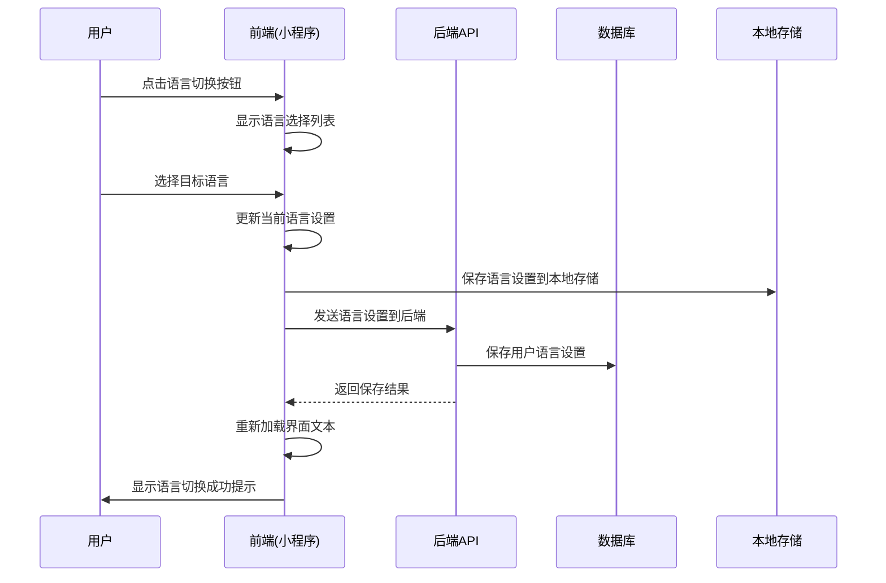

# 微信小程序用户管理系统语言切换和存储机制设计

## 1. 语言切换机制设计

### 1.1 语言切换流程



### 1.2 前端语言切换实现

#### 1.2.1 语言切换组件增强

```javascript
// i18n/components/language-switcher/language-switcher.js
import i18nManager from '../../manager.js';

Component({
  data: {
    currentLocale: 'zh-CN',
    locales: [
      { code: 'en', name: 'English', icon: '/images/flags/en.png' },
      { code: 'zh-CN', name: '简体中文', icon: '/images/flags/zh-CN.png' },
      { code: 'zh-TW', name: '繁體中文', icon: '/images/flags/zh-TW.png' }
    ],
    showDropdown: false,
    isLoading: false
  },

  lifetimes: {
    attached() {
      // 监听语言变更事件
      this.setupEventListeners();
      
      // 获取当前语言
      this.updateCurrentLocale();
    },
    
    detached() {
      // 移除事件监听
      this.removeEventListeners();
    }
  },

  methods: {
    setupEventListeners() {
      // 监听语言变更事件
      if (wx.event) {
        wx.event.on('localeChange', this.onLocaleChange, this);
      }
      
      // 监听小程序显示事件（用于处理从后台切换到前台的情况）
      wx.onAppShow(this.onAppShow);
    },
    
    removeEventListeners() {
      if (wx.event) {
        wx.event.off('localeChange', this.onLocaleChange, this);
      }
      
      wx.offAppShow(this.onAppShow);
    },
    
    onAppShow() {
      // 小程序从后台切换到前台时，检查语言设置是否被其他设备更改
      this.checkForLocaleUpdates();
    },
    
    async checkForLocaleUpdates() {
      try {
        const response = await wx.request({
          url: `${API_BASE_URL}/user/locale`,
          method: 'GET',
          header: {
            'Authorization': `Bearer ${wx.getStorageSync('token')}`
          }
        });
        
        if (response.statusCode === 200 && response.data.code === 200) {
          const serverLocale = response.data.data.locale;
          const localLocale = i18nManager.getCurrentLocale();
          
          if (serverLocale !== localLocale) {
            // 如果服务器语言设置与本地不同，更新本地设置
            await i18nManager.setLocale(serverLocale);
            this.updateCurrentLocale();
            
            wx.showToast({
              title: i18nManager.t('common.languageSynced'),
              icon: 'success'
            });
          }
        }
      } catch (error) {
        console.error('Failed to check for locale updates:', error);
      }
    },
    
    updateCurrentLocale() {
      this.setData({
        currentLocale: i18nManager.getCurrentLocale()
      });
    },
    
    onLocaleChange(locale) {
      this.setData({
        currentLocale: locale
      });
    },
    
    toggleDropdown() {
      this.setData({
        showDropdown: !this.data.showDropdown
      });
    },
    
    hideDropdown() {
      this.setData({
        showDropdown: false
      });
    },
    
    async selectLocale(e) {
      const locale = e.currentTarget.dataset.locale;
      
      if (locale === this.data.currentLocale) {
        this.hideDropdown();
        return;
      }
      
      // 显示加载状态
      this.setData({
        isLoading: true
      });
      
      try {
        // 切换语言
        const success = await i18nManager.setLocale(locale);
        
        if (success) {
          this.setData({
            currentLocale: locale,
            showDropdown: false,
            isLoading: false
          });
          
          wx.showToast({
            title: i18nManager.t('common.languageChanged'),
            icon: 'success'
          });
          
          // 触发全局刷新事件
          this.triggerGlobalRefresh();
        } else {
          this.setData({
            isLoading: false
          });
          
          wx.showToast({
            title: i18nManager.t('common.languageChangeFailed'),
            icon: 'none'
          });
        }
      } catch (error) {
        console.error('Failed to change language:', error);
        
        this.setData({
          isLoading: false
        });
        
        wx.showToast({
          title: i18nManager.t('common.languageChangeError'),
          icon: 'none'
        });
      }
    },
    
    triggerGlobalRefresh() {
      // 触发全局刷新事件，通知所有页面刷新
      const app = getApp();
      if (app && app.globalData) {
        app.globalData.needsRefresh = true;
      }
      
      // 触发自定义事件
      wx.event && wx.event.emit('globalRefresh');
      
      // 如果当前页面有刷新方法，调用它
      const pages = getCurrentPages();
      if (pages.length > 0) {
        const currentPage = pages[pages.length - 1];
        if (currentPage.onLanguageChange && typeof currentPage.onLanguageChange === 'function') {
          currentPage.onLanguageChange();
        }
      }
    },
    
    getCurrentLocaleName() {
      const locale = this.data.locales.find(l => l.code === this.data.currentLocale);
      return locale ? locale.name : '';
    },
    
    getCurrentLocaleIcon() {
      const locale = this.data.locales.find(l => l.code === this.data.currentLocale);
      return locale ? locale.icon : '';
    }
  }
});
```

#### 1.2.2 语言切换组件WXML

```xml
<!-- i18n/components/language-switcher/language-switcher.wxml -->
<view class="language-switcher" bindtap="toggleDropdown">
  <view class="current-language">
    <image class="flag-icon" src="{{getCurrentLocaleIcon()}}"></image>
    <text>{{getCurrentLocaleName()}}</text>
    <image 
      class="dropdown-icon {{showDropdown ? 'rotated' : ''}}" 
      src="/images/dropdown-icon.png"
    ></image>
  </view>
  
  <view class="dropdown-mask" wx:if="{{showDropdown}}" bindtap="hideDropdown"></view>
  
  <view class="dropdown {{showDropdown ? 'show' : ''}}">
    <view 
      class="dropdown-item {{item.code === currentLocale ? 'active' : ''}}" 
      wx:for="{{locales}}" 
      wx:key="code"
      data-locale="{{item.code}}"
      bindtap="selectLocale"
    >
      <image class="flag-icon" src="{{item.icon}}"></image>
      <text>{{item.name}}</text>
      <image 
        class="check-icon" 
        src="/images/check-icon.png" 
        wx:if="{{item.code === currentLocale}}"
      ></image>
    </view>
  </view>
  
  <view class="loading-overlay" wx:if="{{isLoading}}">
    <view class="loading-spinner"></view>
    <text>{{i18n.t('common.changingLanguage')}}</text>
  </view>
</view>
```

#### 1.2.3 语言切换组件WXSS

```css
/* i18n/components/language-switcher/language-switcher.wxss */
.language-switcher {
  position: relative;
  display: inline-block;
}

.current-language {
  display: flex;
  align-items: center;
  padding: 10rpx 20rpx;
  background-color: #f5f5f5;
  border-radius: 8rpx;
}

.flag-icon {
  width: 32rpx;
  height: 24rpx;
  margin-right: 10rpx;
  border-radius: 4rpx;
}

.current-language text {
  font-size: 28rpx;
  color: #333;
  margin-right: 10rpx;
}

.dropdown-icon {
  width: 24rpx;
  height: 24rpx;
  transition: transform 0.3s;
}

.dropdown-icon.rotated {
  transform: rotate(180deg);
}

.dropdown-mask {
  position: fixed;
  top: 0;
  left: 0;
  width: 100%;
  height: 100%;
  background-color: rgba(0, 0, 0, 0.3);
  z-index: 998;
}

.dropdown {
  position: absolute;
  top: 100%;
  right: 0;
  margin-top: 10rpx;
  background-color: #fff;
  border-radius: 8rpx;
  box-shadow: 0 4rpx 20rpx rgba(0, 0, 0, 0.1);
  z-index: 999;
  min-width: 300rpx;
  opacity: 0;
  transform: translateY(-10rpx);
  transition: opacity 0.3s, transform 0.3s;
  pointer-events: none;
}

.dropdown.show {
  opacity: 1;
  transform: translateY(0);
  pointer-events: auto;
}

.dropdown-item {
  display: flex;
  align-items: center;
  padding: 20rpx;
  border-bottom: 1rpx solid #f0f0f0;
}

.dropdown-item:last-child {
  border-bottom: none;
}

.dropdown-item.active {
  background-color: #f0f7ff;
}

.dropdown-item .flag-icon {
  width: 32rpx;
  height: 24rpx;
  margin-right: 15rpx;
}

.dropdown-item text {
  flex: 1;
  font-size: 28rpx;
  color: #333;
}

.dropdown-item .check-icon {
  width: 24rpx;
  height: 24rpx;
}

.loading-overlay {
  position: fixed;
  top: 0;
  left: 0;
  width: 100%;
  height: 100%;
  background-color: rgba(0, 0, 0, 0.5);
  display: flex;
  flex-direction: column;
  justify-content: center;
  align-items: center;
  z-index: 1000;
}

.loading-spinner {
  width: 60rpx;
  height: 60rpx;
  border: 4rpx solid rgba(255, 255, 255, 0.3);
  border-top-color: #fff;
  border-radius: 50%;
  animation: spin 1s linear infinite;
  margin-bottom: 20rpx;
}

.loading-overlay text {
  color: #fff;
  font-size: 28rpx;
}

@keyframes spin {
  to {
    transform: rotate(360deg);
  }
}
```

### 1.3 国际化管理器增强

```javascript
// i18n/manager.js
class I18nManager {
  constructor() {
    this.currentLocale = 'zh-CN'; // 默认语言
    this.locales = {}; // 语言资源缓存
    this.fallbackLocale = 'zh-CN'; // 回退语言
    this.isInitialized = false;
    this.initPromise = null;
    this.changeCallbacks = []; // 语言变更回调函数
  }

  // 初始化国际化管理器
  async init() {
    if (this.isInitialized) {
      return;
    }
    
    if (this.initPromise) {
      return this.initPromise;
    }
    
    this.initPromise = this._initInternal();
    return this.initPromise;
  }

  async _initInternal() {
    try {
      // 从本地存储获取用户语言设置
      const savedLocale = wx.getStorageSync('userLocale');
      
      if (savedLocale && this.isValidLocale(savedLocale)) {
        this.currentLocale = savedLocale;
      } else {
        // 从后端获取用户语言设置
        const userLocale = await this.fetchUserLocaleFromBackend();
        if (userLocale && this.isValidLocale(userLocale)) {
          this.currentLocale = userLocale;
        }
      }
      
      // 加载语言资源
      await this.loadLocales();
      this.isInitialized = true;
      
      // 保存到本地存储
      wx.setStorageSync('userLocale', this.currentLocale);
      
      // 通知初始化完成
      this.notifyInitComplete();
    } catch (error) {
      console.error('Failed to initialize I18nManager:', error);
      
      // 即使初始化失败，也要设置为已初始化，避免阻塞
      this.isInitialized = true;
      this.notifyInitComplete();
    } finally {
      this.initPromise = null;
    }
  }

  // 通知初始化完成
  notifyInitComplete() {
    this.changeCallbacks.forEach(callback => {
      try {
        callback(this.currentLocale);
      } catch (error) {
        console.error('Error in locale change callback:', error);
      }
    });
  }

  // 添加语言变更回调
  addChangeCallback(callback) {
    if (typeof callback === 'function') {
      this.changeCallbacks.push(callback);
    }
  }

  // 移除语言变更回调
  removeChangeCallback(callback) {
    const index = this.changeCallbacks.indexOf(callback);
    if (index !== -1) {
      this.changeCallbacks.splice(index, 1);
    }
  }

  // 验证语言代码是否有效
  isValidLocale(locale) {
    return ['en', 'zh-CN', 'zh-TW'].includes(locale);
  }

  // 从后端获取用户语言设置
  async fetchUserLocaleFromBackend() {
    try {
      const token = wx.getStorageSync('token');
      if (!token) {
        return null;
      }
      
      const response = await wx.request({
        url: `${API_BASE_URL}/user/locale`,
        method: 'GET',
        header: {
          'Authorization': `Bearer ${token}`
        }
      });
      
      if (response.statusCode === 200 && response.data.code === 200) {
        return response.data.data.locale;
      }
    } catch (error) {
      console.error('Failed to fetch user locale from backend:', error);
    }
    
    return null;
  }

  // 加载语言资源
  async loadLocales() {
    const locales = ['en', 'zh-CN', 'zh-TW'];
    
    for (const locale of locales) {
      try {
        // 优先从本地缓存加载
        const cachedLocale = this.loadLocaleFromCache(locale);
        if (cachedLocale) {
          this.locales[locale] = cachedLocale;
        }
        
        // 异步从后端更新语言资源
        this.updateLocaleFromBackend(locale);
      } catch (error) {
        console.error(`Failed to load locale ${locale}:`, error);
        this.locales[locale] = {};
      }
    }
  }

  // 从缓存加载语言资源
  loadLocaleFromCache(locale) {
    try {
      const cacheKey = `locale_${locale}`;
      const cachedData = wx.getStorageSync(cacheKey);
      
      if (cachedData) {
        const { data, timestamp } = cachedData;
        const now = Date.now();
        
        // 缓存有效期为24小时
        if (now - timestamp < 24 * 60 * 60 * 1000) {
          return data;
        }
      }
    } catch (error) {
      console.error(`Failed to load locale ${locale} from cache:`, error);
    }
    
    return null;
  }

  // 从后端更新语言资源
  async updateLocaleFromBackend(locale) {
    try {
      const response = await wx.request({
        url: `${API_BASE_URL}/i18n/locales/${locale}`,
        method: 'GET'
      });
      
      if (response.statusCode === 200 && response.data.code === 200) {
        const localeData = response.data.data;
        
        // 更新内存中的语言资源
        this.locales[locale] = localeData;
        
        // 更新缓存
        this.saveLocaleToCache(locale, localeData);
      }
    } catch (error) {
      console.error(`Failed to update locale ${locale} from backend:`, error);
    }
  }

  // 保存语言资源到缓存
  saveLocaleToCache(locale, data) {
    try {
      const cacheKey = `locale_${locale}`;
      const cacheData = {
        data,
        timestamp: Date.now()
      };
      
      wx.setStorageSync(cacheKey, cacheData);
    } catch (error) {
      console.error(`Failed to save locale ${locale} to cache:`, error);
    }
  }

  // 切换语言
  async setLocale(locale) {
    if (!this.isValidLocale(locale)) {
      console.error(`Invalid locale: ${locale}`);
      return false;
    }
    
    if (locale === this.currentLocale) {
      return true;
    }
    
    this.currentLocale = locale;
    
    // 保存到本地存储
    wx.setStorageSync('userLocale', locale);
    
    // 保存到后端
    try {
      await this.saveUserLocaleToBackend(locale);
    } catch (error) {
      console.error('Failed to save user locale to backend:', error);
      // 即使保存到后端失败，也继续执行
    }
    
    // 通知所有页面语言已更改
    this.notifyLocaleChange();
    
    return true;
  }

  // 保存用户语言设置到后端
  async saveUserLocaleToBackend(locale) {
    const token = wx.getStorageSync('token');
    if (!token) {
      return;
    }
    
    const response = await wx.request({
      url: `${API_BASE_URL}/user/locale`,
      method: 'PUT',
      data: { locale },
      header: {
        'Authorization': `Bearer ${token}`
      }
    });
    
    if (response.statusCode !== 200 || response.data.code !== 200) {
      throw new Error('Failed to save user locale to backend');
    }
  }

  // 获取当前语言
  getCurrentLocale() {
    return this.currentLocale;
  }

  // 获取翻译文本
  t(key, params = {}) {
    if (!this.isInitialized) {
      console.warn('I18nManager not initialized');
      return key;
    }
    
    const locale = this.locales[this.currentLocale];
    if (!locale) {
      console.warn(`Locale ${this.currentLocale} not loaded`);
      return key;
    }
    
    // 支持嵌套键，如 'user.profile.title'
    const keys = key.split('.');
    let value = locale;
    
    for (const k of keys) {
      if (value && typeof value === 'object' && k in value) {
        value = value[k];
      } else {
        // 如果当前语言没有找到翻译，尝试回退语言
        if (this.currentLocale !== this.fallbackLocale) {
          const fallbackValue = this.getFallbackTranslation(key);
          if (fallbackValue !== key) {
            return this.interpolate(fallbackValue, params);
          }
        }
        return key;
      }
    }
    
    if (typeof value !== 'string') {
      return key;
    }
    
    return this.interpolate(value, params);
  }

  // 获取回退翻译
  getFallbackTranslation(key) {
    const fallbackLocale = this.locales[this.fallbackLocale];
    if (!fallbackLocale) {
      return key;
    }
    
    const keys = key.split('.');
    let value = fallbackLocale;
    
    for (const k of keys) {
      if (value && typeof value === 'object' && k in value) {
        value = value[k];
      } else {
        return key;
      }
    }
    
    return typeof value === 'string' ? value : key;
  }

  // 参数插值
  interpolate(text, params) {
    return text.replace(/\{(\w+)\}/g, (match, key) => {
      return key in params ? params[key] : match;
    });
  }

  // 通知语言变更
  notifyLocaleChange() {
    // 通知所有回调函数
    this.changeCallbacks.forEach(callback => {
      try {
        callback(this.currentLocale);
      } catch (error) {
        console.error('Error in locale change callback:', error);
      }
    });
    
    // 通过全局事件通知所有页面
    const app = getApp();
    if (app && app.globalData) {
      app.globalData.currentLocale = this.currentLocale;
      app.globalData.localeChanged = Date.now();
    }
    
    // 触发自定义事件
    wx.event && wx.event.emit('localeChange', this.currentLocale);
  }

  // 格式化日期
  formatDate(date, format) {
    // 根据当前语言格式化日期
    if (this.currentLocale === 'en') {
      return this.formatDateEn(date, format);
    } else if (this.currentLocale === 'zh-CN' || this.currentLocale === 'zh-TW') {
      return this.formatDateZh(date, format);
    }
    
    return date.toLocaleDateString();
  }

  formatDateEn(date, format) {
    const options = {
      year: 'numeric',
      month: 'short',
      day: 'numeric'
    };
    
    return date.toLocaleDateString('en-US', options);
  }

  formatDateZh(date, format) {
    const year = date.getFullYear();
    const month = date.getMonth() + 1;
    const day = date.getDate();
    
    return `${year}年${month}月${day}日`;
  }

  // 格式化数字
  formatNumber(number) {
    if (this.currentLocale === 'en') {
      return number.toLocaleString('en-US');
    } else if (this.currentLocale === 'zh-CN' || this.currentLocale === 'zh-TW') {
      return number.toLocaleString('zh-CN');
    }
    
    return number.toString();
  }

  // 获取支持的语言列表
  getSupportedLocales() {
    return [
      { code: 'en', name: 'English', nativeName: 'English' },
      { code: 'zh-CN', name: 'Simplified Chinese', nativeName: '简体中文' },
      { code: 'zh-TW', name: 'Traditional Chinese', nativeName: '繁體中文' }
    ];
  }
}

// 导出单例
export default new I18nManager();
```

## 2. 语言存储机制设计

### 2.1 前端存储机制

#### 2.1.1 本地存储策略

```javascript
// i18n/storage.js
class I18nStorage {
  constructor() {
    this.STORAGE_KEYS = {
      USER_LOCALE: 'userLocale',           // 用户语言设置
      LOCALE_CACHE: 'locale_cache_',      // 语言资源缓存前缀
      LOCALE_VERSION: 'locale_version',    // 语言资源版本
      LAST_SYNC: 'locale_last_sync'       // 最后同步时间
    };
  }

  // 保存用户语言设置
  saveUserLocale(locale) {
    try {
      wx.setStorageSync(this.STORAGE_KEYS.USER_LOCALE, locale);
      return true;
    } catch (error) {
      console.error('Failed to save user locale to storage:', error);
      return false;
    }
  }

  // 获取用户语言设置
  getUserLocale() {
    try {
      return wx.getStorageSync(this.STORAGE_KEYS.USER_LOCALE);
    } catch (error) {
      console.error('Failed to get user locale from storage:', error);
      return null;
    }
  }

  // 保存语言资源缓存
  saveLocaleCache(locale, data) {
    try {
      const cacheKey = this.STORAGE_KEYS.LOCALE_CACHE + locale;
      const cacheData = {
        data,
        timestamp: Date.now(),
        version: this.getLocaleVersion()
      };
      
      wx.setStorageSync(cacheKey, cacheData);
      return true;
    } catch (error) {
      console.error(`Failed to save locale cache for ${locale}:`, error);
      return false;
    }
  }

  // 获取语言资源缓存
  getLocaleCache(locale) {
    try {
      const cacheKey = this.STORAGE_KEYS.LOCALE_CACHE + locale;
      const cachedData = wx.getStorageSync(cacheKey);
      
      if (!cachedData) {
        return null;
      }
      
      const { data, timestamp, version } = cachedData;
      const currentVersion = this.getLocaleVersion();
      
      // 检查版本是否匹配
      if (version !== currentVersion) {
        console.log(`Locale cache for ${locale} is outdated, version mismatch`);
        return null;
      }
      
      // 检查是否过期（24小时）
      const now = Date.now();
      const maxAge = 24 * 60 * 60 * 1000; // 24小时
      
      if (now - timestamp > maxAge) {
        console.log(`Locale cache for ${locale} is expired`);
        return null;
      }
      
      return data;
    } catch (error) {
      console.error(`Failed to get locale cache for ${locale}:`, error);
      return null;
    }
  }

  // 清除语言资源缓存
  clearLocaleCache(locale) {
    try {
      if (locale) {
        // 清除特定语言的缓存
        const cacheKey = this.STORAGE_KEYS.LOCALE_CACHE + locale;
        wx.removeStorageSync(cacheKey);
      } else {
        // 清除所有语言缓存
        const keys = wx.getStorageInfoSync().keys;
        keys.forEach(key => {
          if (key.startsWith(this.STORAGE_KEYS.LOCALE_CACHE)) {
            wx.removeStorageSync(key);
          }
        });
      }
      return true;
    } catch (error) {
      console.error('Failed to clear locale cache:', error);
      return false;
    }
  }

  // 保存语言资源版本
  saveLocaleVersion(version) {
    try {
      wx.setStorageSync(this.STORAGE_KEYS.LOCALE_VERSION, version);
      return true;
    } catch (error) {
      console.error('Failed to save locale version:', error);
      return false;
    }
  }

  // 获取语言资源版本
  getLocaleVersion() {
    try {
      return wx.getStorageSync(this.STORAGE_KEYS.LOCALE_VERSION) || '1.0.0';
    } catch (error) {
      console.error('Failed to get locale version:', error);
      return '1.0.0';
    }
  }

  // 保存最后同步时间
  saveLastSyncTime() {
    try {
      wx.setStorageSync(this.STORAGE_KEYS.LAST_SYNC, Date.now());
      return true;
    } catch (error) {
      console.error('Failed to save last sync time:', error);
      return false;
    }
  }

  // 获取最后同步时间
  getLastSyncTime() {
    try {
      return wx.getStorageSync(this.STORAGE_KEYS.LAST_SYNC) || 0;
    } catch (error) {
      console.error('Failed to get last sync time:', error);
      return 0;
    }
  }

  // 检查是否需要同步
  needsSync() {
    const lastSync = this.getLastSyncTime();
    const now = Date.now();
    const syncInterval = 60 * 60 * 1000; // 1小时
    
    return now - lastSync > syncInterval;
  }

  // 清除所有国际化相关存储
  clearAll() {
    try {
      // 清除用户语言设置
      wx.removeStorageSync(this.STORAGE_KEYS.USER_LOCALE);
      
      // 清除语言资源版本
      wx.removeStorageSync(this.STORAGE_KEYS.LOCALE_VERSION);
      
      // 清除最后同步时间
      wx.removeStorageSync(this.STORAGE_KEYS.LAST_SYNC);
      
      // 清除所有语言缓存
      this.clearLocaleCache();
      
      return true;
    } catch (error) {
      console.error('Failed to clear all i18n storage:', error);
      return false;
    }
  }
}

// 导出单例
export default new I18nStorage();
```

#### 2.1.2 存储与国际化管理器集成

```javascript
// i18n/manager.js (增强版)
import I18nStorage from './storage.js';

class I18nManager {
  constructor() {
    // ... 其他初始化代码 ...
    this.storage = new I18nStorage();
  }

  // 初始化国际化管理器
  async init() {
    if (this.isInitialized) {
      return;
    }
    
    if (this.initPromise) {
      return this.initPromise;
    }
    
    this.initPromise = this._initInternal();
    return this.initPromise;
  }

  async _initInternal() {
    try {
      // 从本地存储获取用户语言设置
      const savedLocale = this.storage.getUserLocale();
      
      if (savedLocale && this.isValidLocale(savedLocale)) {
        this.currentLocale = savedLocale;
      } else {
        // 从后端获取用户语言设置
        const userLocale = await this.fetchUserLocaleFromBackend();
        if (userLocale && this.isValidLocale(userLocale)) {
          this.currentLocale = userLocale;
          // 保存到本地存储
          this.storage.saveUserLocale(userLocale);
        }
      }
      
      // 检查是否需要同步语言资源
      if (this.storage.needsSync()) {
        await this.syncLocales();
      } else {
        // 加载语言资源
        await this.loadLocales();
      }
      
      this.isInitialized = true;
      
      // 通知初始化完成
      this.notifyInitComplete();
    } catch (error) {
      console.error('Failed to initialize I18nManager:', error);
      
      // 即使初始化失败，也要设置为已初始化，避免阻塞
      this.isInitialized = true;
      this.notifyInitComplete();
    } finally {
      this.initPromise = null;
    }
  }

  // 同步语言资源
  async syncLocales() {
    try {
      const locales = ['en', 'zh-CN', 'zh-TW'];
      
      // 获取语言资源版本
      const versionResponse = await wx.request({
        url: `${API_BASE_URL}/i18n/version`,
        method: 'GET'
      });
      
      if (versionResponse.statusCode === 200 && versionResponse.data.code === 200) {
        const serverVersion = versionResponse.data.data.version;
        const localVersion = this.storage.getLocaleVersion();
        
        // 如果版本不同，清除缓存
        if (serverVersion !== localVersion) {
          this.storage.clearLocaleCache();
          this.storage.saveLocaleVersion(serverVersion);
        }
      }
      
      // 加载语言资源
      for (const locale of locales) {
        await this.updateLocaleFromBackend(locale);
      }
      
      // 更新最后同步时间
      this.storage.saveLastSyncTime();
    } catch (error) {
      console.error('Failed to sync locales:', error);
      
      // 如果同步失败，尝试从缓存加载
      await this.loadLocales();
    }
  }

  // 加载语言资源
  async loadLocales() {
    const locales = ['en', 'zh-CN', 'zh-TW'];
    
    for (const locale of locales) {
      try {
        // 优先从缓存加载
        const cachedLocale = this.storage.getLocaleCache(locale);
        if (cachedLocale) {
          this.locales[locale] = cachedLocale;
        } else {
          // 如果缓存中没有，从本地文件加载
          this.locales[locale] = await this.loadLocalLocale(locale);
        }
      } catch (error) {
        console.error(`Failed to load locale ${locale}:`, error);
        this.locales[locale] = {};
      }
    }
  }

  // 从后端更新语言资源
  async updateLocaleFromBackend(locale) {
    try {
      const response = await wx.request({
        url: `${API_BASE_URL}/i18n/locales/${locale}`,
        method: 'GET'
      });
      
      if (response.statusCode === 200 && response.data.code === 200) {
        const localeData = response.data.data;
        
        // 更新内存中的语言资源
        this.locales[locale] = localeData;
        
        // 更新缓存
        this.storage.saveLocaleCache(locale, localeData);
      }
    } catch (error) {
      console.error(`Failed to update locale ${locale} from backend:`, error);
    }
  }

  // 切换语言
  async setLocale(locale) {
    if (!this.isValidLocale(locale)) {
      console.error(`Invalid locale: ${locale}`);
      return false;
    }
    
    if (locale === this.currentLocale) {
      return true;
    }
    
    this.currentLocale = locale;
    
    // 保存到本地存储
    this.storage.saveUserLocale(locale);
    
    // 保存到后端
    try {
      await this.saveUserLocaleToBackend(locale);
    } catch (error) {
      console.error('Failed to save user locale to backend:', error);
      // 即使保存到后端失败，也继续执行
    }
    
    // 通知所有页面语言已更改
    this.notifyLocaleChange();
    
    return true;
  }

  // ... 其他方法保持不变 ...
}

// 导出单例
export default new I18nManager();
```

### 2.2 后端存储机制

#### 2.2.1 用户语言设置API

```python
# app/api/v1/i18n.py
from fastapi import APIRouter, Depends, HTTPException, Request
from sqlalchemy.orm import Session
from app.core.security import get_current_user
from app.crud.i18n import crud_user_locale
from app.schemas.i18n import UserLocaleCreate, UserLocaleUpdate
from app.models.user import User
from app.core.database import get_db

router = APIRouter()

@router.get("/user/locale")
async def get_user_locale(
    request: Request,
    current_user: User = Depends(get_current_user),
    db: Session = Depends(get_db)
):
    """获取用户语言设置"""
    try:
        user_locale = crud_user_locale.get_by_user_id(db, user_id=current_user.id)
        
        if not user_locale:
            # 如果没有设置，返回默认语言
            return {
                "code": 200,
                "message": "Success",
                "data": {
                    "locale": "zh-CN"
                }
            }
        
        return {
            "code": 200,
            "message": "Success",
            "data": {
                "locale": user_locale.locale
            }
        }
    except Exception as e:
        raise HTTPException(status_code=500, detail=str(e))

@router.put("/user/locale")
async def update_user_locale(
    locale_data: UserLocaleUpdate,
    request: Request,
    current_user: User = Depends(get_current_user),
    db: Session = Depends(get_db)
):
    """更新用户语言设置"""
    try:
        # 验证语言代码
        supported_locales = ['en', 'zh-CN', 'zh-TW']
        if locale_data.locale not in supported_locales:
            return {
                "code": 400,
                "message": "Unsupported locale",
                "data": None
            }
        
        # 查找现有设置
        user_locale = crud_user_locale.get_by_user_id(db, user_id=current_user.id)
        
        if user_locale:
            # 更新现有设置
            updated_locale = crud_user_locale.update(
                db, db_obj=user_locale, obj_in=locale_data
            )
        else:
            # 创建新设置
            locale_in = UserLocaleCreate(
                user_id=current_user.id,
                locale=locale_data.locale
            )
            updated_locale = crud_user_locale.create(db, obj_in=locale_in)
        
        return {
            "code": 200,
            "message": "Locale updated successfully",
            "data": {
                "locale": updated_locale.locale
            }
        }
    except Exception as e:
        raise HTTPException(status_code=500, detail=str(e))

@router.get("/i18n/version")
async def get_locale_version():
    """获取语言资源版本"""
    try:
        # 这里可以从数据库或配置文件中获取版本号
        version = "1.0.0"
        
        return {
            "code": 200,
            "message": "Success",
            "data": {
                "version": version
            }
        }
    except Exception as e:
        raise HTTPException(status_code=500, detail=str(e))

@router.get("/i18n/locales/{locale}")
async def get_locale_data(
    locale: str,
    request: Request,
    db: Session = Depends(get_db)
):
    """获取指定语言的语言资源"""
    try:
        # 验证语言代码
        supported_locales = ['en', 'zh-CN', 'zh-TW']
        if locale not in supported_locales:
            return {
                "code": 400,
                "message": "Unsupported locale",
                "data": None
            }
        
        # 从数据库获取翻译数据
        translations = crud_user_locale.get_translations_by_locale(db, locale=locale)
        
        # 转换为前端需要的格式
        locale_data = {}
        for translation in translations:
            # 支持嵌套键，如 'user.profile.title'
            keys = translation.key.split('.')
            current = locale_data
            
            for i, key in enumerate(keys):
                if i === len(keys) - 1:
                    current[key] = translation.value
                else:
                    if key not in current:
                        current[key] = {}
                    current = current[key]
        
        return {
            "code": 200,
            "message": "Success",
            "data": locale_data
        }
    except Exception as e:
        raise HTTPException(status_code=500, detail=str(e))
```

#### 2.2.2 用户语言设置CRUD操作

```python
# app/crud/i18n.py
from sqlalchemy.orm import Session
from app.models.i18n import UserLocale, Translation
from app.schemas.i18n import UserLocaleCreate, UserLocaleUpdate
from typing import List, Optional

class CRUDUserLocale:
    def get_by_user_id(self, db: Session, *, user_id: int) -> Optional[UserLocale]:
        return db.query(UserLocale).filter(UserLocale.user_id == user_id).first()

    def create(self, db: Session, *, obj_in: UserLocaleCreate) -> UserLocale:
        db_obj = UserLocale(
            user_id=obj_in.user_id,
            locale=obj_in.locale,
            is_default=obj_in.is_default
        )
        db.add(db_obj)
        db.commit()
        db.refresh(db_obj)
        return db_obj

    def update(
        self, db: Session, *, db_obj: UserLocale, obj_in: UserLocaleUpdate
    ) -> UserLocale:
        if obj_in.locale is not None:
            db_obj.locale = obj_in.locale
        if obj_in.is_default is not None:
            db_obj.is_default = obj_in.is_default
        
        db.add(db_obj)
        db.commit()
        db.refresh(db_obj)
        return db_obj

    def get_translations_by_locale(self, db: Session, *, locale: str) -> List[Translation]:
        return db.query(Translation).filter(Translation.locale == locale).all()

crud_user_locale = CRUDUserLocale()
```

#### 2.2.3 用户语言设置数据模型

```python
# app/schemas/i18n.py
from pydantic import BaseModel, Field
from typing import Optional

class UserLocaleBase(BaseModel):
    locale: str = Field(..., description="语言代码")
    is_default: bool = Field(False, description="是否为默认语言")

class UserLocaleCreate(UserLocaleBase):
    user_id: int = Field(..., description="用户ID")

class UserLocaleUpdate(UserLocaleBase):
    pass

class UserLocale(UserLocaleBase):
    id: int
    user_id: int
    
    class Config:
        orm_mode = True
```

### 2.3 数据库存储机制

#### 2.3.1 用户语言设置表

```sql
-- 用户语言设置表
CREATE TABLE user_locales (
    id BIGSERIAL PRIMARY KEY,
    user_id BIGINT NOT NULL UNIQUE,
    locale VARCHAR(10) NOT NULL DEFAULT 'zh-CN',
    is_default BOOLEAN DEFAULT FALSE,
    created_at TIMESTAMP WITH TIME ZONE DEFAULT CURRENT_TIMESTAMP,
    updated_at TIMESTAMP WITH TIME ZONE DEFAULT CURRENT_TIMESTAMP,
    
    FOREIGN KEY (user_id) REFERENCES users(id) ON DELETE CASCADE
);

-- 创建索引
CREATE INDEX idx_user_locales_user_id ON user_locales(user_id);
CREATE INDEX idx_user_locales_locale ON user_locales(locale);

-- 创建更新时间触发器
CREATE TRIGGER update_user_locales_updated_at BEFORE UPDATE ON user_locales FOR EACH ROW EXECUTE PROCEDURE update_updated_at_column();
```

#### 2.3.2 翻译表

```sql
-- 翻译表
CREATE TABLE translations (
    id BIGSERIAL PRIMARY KEY,
    key VARCHAR(255) NOT NULL,
    locale VARCHAR(10) NOT NULL,
    value TEXT NOT NULL,
    context VARCHAR(255),
    created_at TIMESTAMP WITH TIME ZONE DEFAULT CURRENT_TIMESTAMP,
    updated_at TIMESTAMP WITH TIME ZONE DEFAULT CURRENT_TIMESTAMP,
    
    UNIQUE(key, locale)
);

-- 创建索引
CREATE INDEX idx_translations_key ON translations(key);
CREATE INDEX idx_translations_locale ON translations(locale);
CREATE INDEX idx_translations_key_locale ON translations(key, locale);

-- 创建更新时间触发器
CREATE TRIGGER update_translations_updated_at BEFORE UPDATE ON translations FOR EACH ROW EXECUTE PROCEDURE update_updated_at_column();
```

## 3. 语言切换和存储的最佳实践

### 3.1 性能优化

1. **缓存策略**
   - 前端使用本地存储缓存语言资源，减少网络请求
   - 后端使用Redis缓存常用翻译，提高响应速度
   - 设置合理的缓存过期时间，平衡性能和数据新鲜度

2. **按需加载**
   - 只加载当前需要的语言资源，不一次性加载所有语言
   - 根据页面路由，动态加载对应页面的翻译资源
   - 实现语言资源的懒加载，提高小程序启动速度

3. **资源压缩**
   - 对语言资源进行压缩，减少传输数据量
   - 使用高效的序列化格式，如MessagePack
   - 移除不必要的空格和注释，减小文件体积

### 3.2 用户体验优化

1. **流畅切换**
   - 语言切换过程中显示加载状态，避免用户困惑
   - 切换完成后立即更新界面，提供即时反馈
   - 保存用户选择，下次进入时自动应用

2. **错误处理**
   - 网络错误时提供友好的提示，不显示技术细节
   - 语言资源加载失败时自动回退到默认语言
   - 提供重试机制，允许用户手动刷新语言资源

3. **一致性保证**
   - 确保所有界面元素都支持语言切换
   - 保持前后端语言设置的一致性
   - 处理多设备登录时的语言同步问题

### 3.3 安全考虑

1. **数据验证**
   - 验证用户提交的语言代码，防止恶意输入
   - 限制语言切换频率，防止滥用
   - 对敏感操作进行权限检查

2. **数据保护**
   - 使用HTTPS传输语言资源，防止中间人攻击
   - 对用户语言设置进行适当的访问控制
   - 记录语言变更日志，便于审计

3. **容错机制**
   - 设计健壮的错误恢复机制
   - 实现优雅降级，确保核心功能不受影响
   - 提供默认语言，避免界面显示异常

## 4. 总结

本文档详细设计了微信小程序用户管理系统的语言切换和存储机制，包括：

1. **语言切换机制**：设计了完整的语言切换流程，包括前端组件、国际化管理器和事件通知机制。
2. **前端存储机制**：设计了本地存储策略，包括用户语言设置、语言资源缓存和版本控制。
3. **后端存储机制**：设计了用户语言设置API、CRUD操作和数据模型。
4. **数据库存储机制**：设计了用户语言设置表和翻译表的数据库结构。
5. **最佳实践**：提供了性能优化、用户体验优化和安全考虑的建议。

这个语言切换和存储机制设计支持英文、简体中文和繁体中文三种语言，具有良好的性能、用户体验和安全性，能够满足用户对语言切换功能的需求。